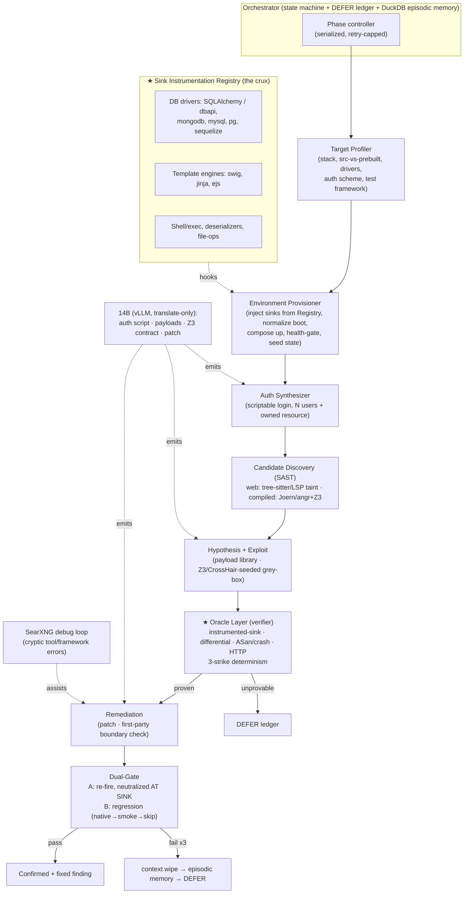

# Orchestrator Design — Neuro-Symbolic Vulnerability Agent

## Context
This design turns the architecture (`docs/revised_plan.md`, refined in `docs/answer.md`) into a
concrete component + control-flow spec, **grounded in what Phase 0 empirically proved**
(`docs/phase0_findings.md`): the full loop — boot → instrument → authenticate → exploit →
observe-at-sink → patch → verify — was run by hand on VAmPI (Python/SQL), brokencrystals
(NestJS/SSO), and NodeGoat (Node/MongoDB, from source). The consistent lesson:

> **The model isn't the crux. Per-driver *sink instrumentation* is.** Detection is carried by the
> instrumented-sink + differential oracles, not by LLM reasoning or Z3 (which barely fires on web
> targets). So the orchestrator is built *around* a pluggable instrumentation library, with the 14B
> in a narrow **translate-only** role and deterministic tools owning every verdict.

Standing constraints (validated in Phase 0): Windows 11 + WSL2 + Docker (no Firecracker/eBPF);
31GB RAM / 16GB VRAM → strict resource serialization; one GPU job at a time.

---

## Design principles (each traces to a finding)
1. **Model translates, tools prove.** The 14B only emits artifacts (auth script, payloads, Z3
   contract, patch); every verdict comes from a deterministic oracle. (root thesis)
2. **The Sink Instrumentation Registry is the heart of the system.** (F1/R2/G1 — proven twice:
   SQLAlchemy `before_cursor_execute`, mongodb `Collection.find`). Instrumentation is **per-driver**,
   so it's a curated, extensible library, not a one-off.
3. **Two pipelines, routed by target type.** `web → DAST + instrumented-sink + differential`;
   `compiled → angr/Z3 + ASan crash oracle`. Z3/CrossHair is a *compiled-pipeline* tool, not the
   web path. (gap C / F3)
4. **Precision-first, bounded recall.** Anything not provable at a sink → **DEFER**, logged. DEFER
   volume is a first-class metric, not a failure. (review stance)
5. **Auth is a scriptable-path problem, not an SSO wall.** Synthesize a login against any scriptable
   credential path; provision **≥2 users + ≥1 owned resource**; SSO-only ⇒ DEFER. (gap A softened, gap B)
6. **Prefer source-available targets; normalize the boot.** From-source instrumentation is cleaner
   (add module + rebuild); always disable app auto-reloaders before instrumenting. (G3, F2)
7. **Gate B is infra-bound; degrade gracefully.** native suite → functional smoke → skip-with-flag,
   never block a correct patch on an un-runnable suite. (G2 / F5 / R1)
8. **Serialize everything; the model and the sandbox are never co-resident.** Unload the 14B from
   VRAM during build/boot/DAST-provisioning. (R6)

---

## Architecture

---

## Component specifications

### 1. Orchestrator (control plane)
A **serialized state machine** over the phases below. Owns:
- **DEFER ledger** — every un-provable candidate + reason (out-of-view sink, SSO-only auth,
  unmodeled class, Z3 timeout). This is the recall-accounting surface.
- **Episodic memory (DuckDB)** — failure summaries keyed by (framework, error-signature) so the
  same tool/patch mistake isn't repeated; consulted before each model call.
- **Guardrails** — max 3 retries per candidate; convergence-delta check (reject near-identical
  retries); Z3 hard timeout (2s) → fall back to fuzzing; context wipe between phases to prevent
  pollution.
- **Resource governor** — enforces "model XOR heavy-container" residency: unload/reload the 14B
  around the build/provision/DAST phases (R6).

### 2. Target Profiler
Input: a repo path (+ optional git-diff). Detects and emits a **TargetProfile**:
`{ languages, framework, build_mode: source|prebuilt, db_drivers[], template_engine, auth_scheme,
test_framework, compose_file, entrypoints[], cloud_deps[] }`. Drives pipeline routing (web vs
compiled) and which Registry hooks to inject. (Generalizes the manual inspection done in Phase 0.)

### 3. Environment Provisioner
- **Inject instrumentation** from the Registry matched to `db_drivers`/`template_engine`:
  - *source-available* (preferred, G3): drop the sink module + one `require`/`import` into the
    entrypoint, rebuild. (exactly `phase0_sink.{py,js}` + the `server.js`/`app.py` edit)
  - *prebuilt image*: layer a child image or bind-mount the hook + wrap the entrypoint.
- **Normalize boot** (F2): disable auto-reloaders / debug forkers that would drop instrumentation.
- **Port + resource reconcile**: publish the app port; dodge host conflicts (Phase 0 hit 5432/3000).
- **`compose up` + health-gate**, then **seed state** (LocalStack for cloud deps only if `cloud_deps`).

### 4. ★ Sink Instrumentation Registry (the crux component)
A curated library of **per-driver hooks**, each turning a sink into a verifiable oracle by logging
the exact value that reaches it *before execution*. Uniform contract:
`hook(sink_event) → {sink_type, statement/target, params, tainted?}`. Seeded by Phase 0:
- `SQLAlchemy/dbapi` → `before_cursor_execute` (payload-in-string vs bound-param). ✅ built
- `mongodb` → `Collection.find/findOne` filter object (catches `$where`/operator injection). ✅ built
- **To add**: `mysql2`/`pg`/`sequelize`, `swig`/`jinja`/`ejs` (XSS), `child_process`/`exec` (cmd),
  `pickle`/`unserialize` (deser), `fs`/path (traversal). Each is small but real per-stack work (R2).
This is the component to build out first and continuously; the plan lives or dies on its coverage.

### 5. Auth Synthesizer
The 14B translates the app's auth routes (from OpenAPI/AST) into a **standalone login script** that
registers/logs in and returns a bearer/cookie; the orchestrator runs it and feeds errors back for
self-repair. **Provisions ≥2 identities (A/B) + ≥1 A-owned resource** so authorization classes are
testable (gap B). If the *only* path is SSO/OAuth redirect → **DEFER** (gap A). (Generalizes
`phase0_exploit.sh` + `phase0_bc_exploit.sh`; brokencrystals proved a scriptable path usually exists.)

### 6. Candidate Discovery (SAST)
git-diff-triggered, slices only affected routes.
- **web pipeline**: tree-sitter/LSP taint from sources (request params/body/headers) to the
  Registry's known sink signatures. Emits ranked `(route, sink, param)` candidates.
- **compiled pipeline**: Joern CPG backward-slice from memory/exec sinks; **Z3 path-feasibility**
  prune before the model; angr for binary paths.

### 7. Hypothesis + Exploit engine
Per candidate, the model translates the slice → a **payload set** from a class library
(SQLi/NoSQLi/XSS/cmd/path/authz polyglots). Grey-box seeding (from `answer.md`): a Z3/CrossHair
`SAT` payload is fired **first**; blind fuzzing only if it's blocked. Fired through the authenticated
DAST driver using A's and B's contexts.

### 8. ★ Oracle Layer (the verifier — owns all verdicts)
- **Instrumented-sink oracle**: payload appears in the Registry hook's log/span *unescaped/unbound*
  ⇒ **proven**. (the primary web oracle — proven on SQLi and `$where`)
- **Differential oracle**: same request under A vs B; unauthorized state == authorized state ⇒ authz
  breach. (proven on IDOR + mass-assignment) Requires the gap-B fixture.
- **Crash/ASan oracle**: compiled build with `-fsanitize=address,undefined`; crash on stderr ⇒
  memory bug. (compiled pipeline; the accepted eBPF replacement)
- **HTTP oracle**: status/latency/error signals (supporting, not sufficient alone).
- **3-strike determinism**: reset state (`docker compose restart db` / SQL reload) and re-fire; 3/3
  to confirm, killing flakiness.

### 9. Remediation + Dual-Gate
Model translates `(vuln slice + sink trace + successful payload)` → **patch**. First-party boundary
check: if the sink is in a dependency, emit an upstream wrapper, not an edit.
- **Gate A (exploit blocked *at the sink*)**: re-fire; the Registry hook must now show the payload
  **neutralized** (bound param / stripped / escaped) — not merely a changed HTTP code. (proven:
  VAmPI `= ?` bound param; NodeGoat `> 1` numeric)
- **Gate B (regression, degrade gracefully — G2)**: `native suite → functional smoke → skip+flag`.
  Never block a correct patch on an un-runnable/absent suite; note which rung was used.
- On 3× failure: context wipe → log to episodic memory → DEFER.

### 10. The 14B (translate-only) + serving
Served via vLLM (4-bit, prefix-cached for the few parallel exploit hypotheses). **Only** produces:
auth script, payloads, Z3/CrossHair contract, patch. Unloaded during container/build phases
(governor). The loop is designed to run with a strong API model first (untrained), then the local
14B — training is optimization, not a prerequisite.

---

## Control flow (state machine)
`PROFILE → PROVISION → AUTH → DISCOVER → {per candidate: HYPOTHESIZE → EXPLOIT → VERIFY} →
REMEDIATE → GATE_A → GATE_B → COMMIT | DEFER`. Every edge can route to **DEFER** with a reason;
retry-capped edges route to **context-wipe → episodic-memory → DEFER**. Phases are strictly
serialized; the resource governor gates model-vs-container residency at each transition.

---

## Build order (grounded in the Phase-0 harness we already have)
1. **Sink Instrumentation Registry** — harden `phase0_sink.{py,js}` into a pluggable library; add the
   next 3–4 drivers (mysql/pg/sequelize + one template engine). *This is the crux; build it first and
   forever.*
2. **Environment Provisioner + Target Profiler** — generalize the manual compose edits, boot-config
   fix, health-gate, port reconcile.
3. **Auth Synthesizer** — generalize the two Phase-0 auth scripts; add the N-users+resource fixture.
4. **Oracle Layer** — generalize the sink-grep + differential checks into a verifier module with the
   3-strike loop.
5. **Orchestrator state machine + DEFER ledger + DuckDB** — wire 1–4 into the serialized loop.
6. **Model integration (translate calls)** — start with an API model; add local 14B + governor.
7. **SAST candidate discovery + symbolic (compiled pipeline)** — last; DAST carried detection in Phase 0.

**MVP milestone**: steps 1–5 with a hand-written candidate list (no SAST, no model) should reproduce
the three Phase-0 results *automatically* end-to-end. That is the orchestrator's first real test.

---

## Open risks / unproven
- **Registry coverage vs. long-tail stacks** — the per-driver cost is real; coverage is the ceiling
  on recall. Mitigation: DEFER-by-default for unhooked sinks; prioritize drivers by target frequency.
- **SAST recall on web langs** (tree-sitter/LSP taint quality) — not yet exercised; the whole
  candidate feed depends on it.
- **Compiled pipeline (angr/Z3/ASan)** — not run in Phase 0 at all; the math-class crux (R3) is still
  unmeasured. A small Juliet/SARD spike remains the right way to de-risk it before investing.
- **Auto-provisioning stateful multi-service apps** (LocalStack coverage, DB seeding depth beyond
  auth) — brokencrystals booted, but deeper business-logic state seeding is untested.
- **Gate B environments** — standing up a target's real test suite (Cypress/selenium/RSpec) per repo
  is its own automation problem; the graceful-degradation ladder is the pragmatic answer for now.
